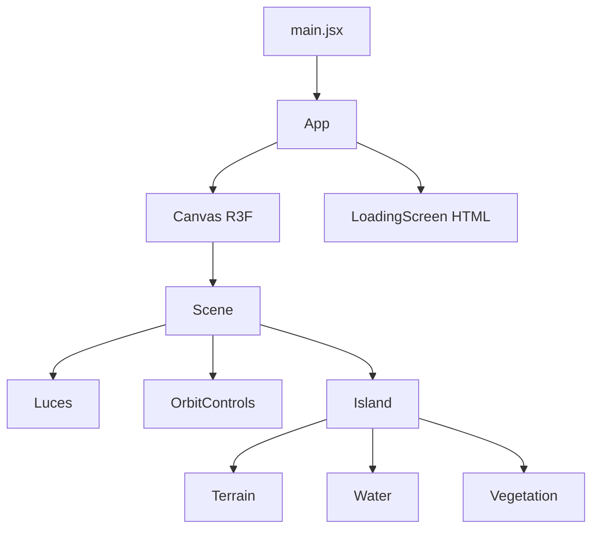
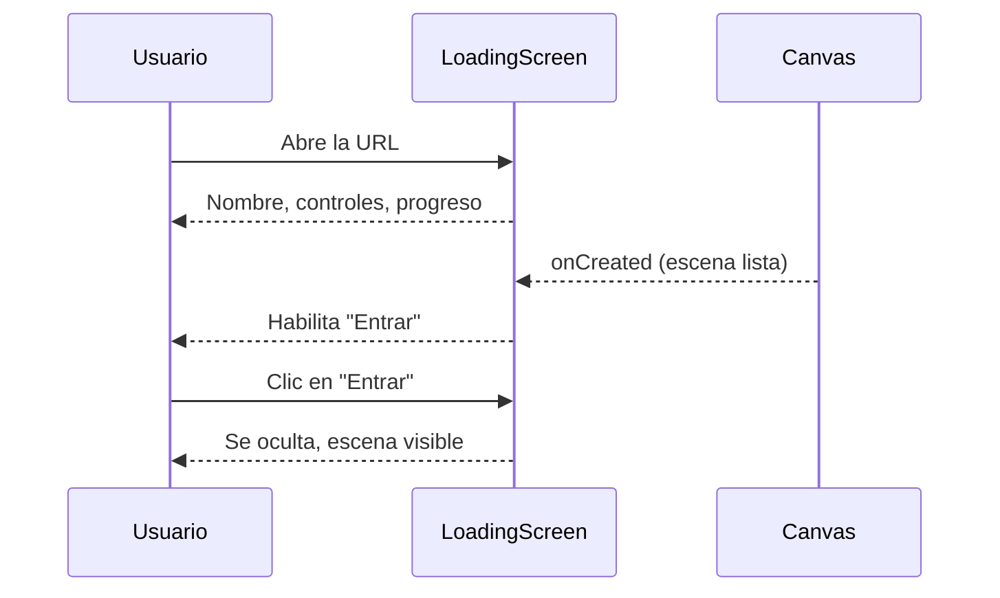

# Arquitectura técnica

## Stack
- **Vite 6** (bundler) + **React 19**
- **Three.js** vía **React Three Fiber** y **@react-three/drei**
- Despliegue: GitHub Pages con GitHub Actions
- Planeado: Zustand (estado, Sprint 3), cannon-es/Rapier (físicas, Sprint 3), Blender → GLB con Draco (Sprint 2)

## Árbol de componentes (Sprint 1)

## Flujo de carga

## Decisiones
| Decisión | Motivo |
|---|---|
| Vite + R3F | Arranque rápido, componentes declarativos |
| `base: './'` en Vite | Rutas relativas válidas en cualquier hosting |
| Terreno procedural (Sprint 1) | Isla provisional hasta tener el modelo de Blender (Sprint 2) |
| Vegetación con semilla fija | La isla se ve igual en cada carga |