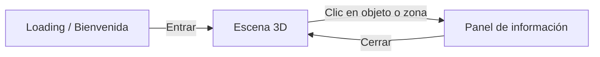

# Wireframes

> Versión inicial en texto/Mermaid. Pendiente: pasarlos a Figma/Excalidraw para la entrega (20 oct 2026).

## 1. Mapa 2D de la isla (vista superior)
```
                 N
        ~~~~~~~~~~~~~~~~~~~~~~
     ~~~~    [CONTACTO]    ~~~~
   ~~~    .-~~~~~~~~~~~-.    ~~~
  ~~    /   (faro/buzón)  \    ~~
 ~~    |                   |    ~~
 ~~ [HABILIDADES]   [PROYECTOS]  ~~
 ~~    |   (taller)  (galería) |  ~~
  ~~    \     [SOBRE MÍ]     /   ~~
   ~~~    '-.  (casa)   .-'   ~~~
     ~~~~     [ENTRADA]     ~~~~
        ~~~~~ (muelle) ~~~~~
```
| Zona | Contenido | Objeto 3D representativo |
|---|---|---|
| Entrada | Punto de inicio del personaje | Muelle |
| Sobre mí | Bio y trayectoria | Casa |
| Habilidades | Tecnologías | Taller / herramientas |
| Proyectos | Proyectos destacados | Galería con pantallas |
| Contacto | Correo, LinkedIn, GitHub | Faro / buzón |

## 2. Flujo de pantallas


## 3. Pantalla de bienvenida
```
+--------------------------------------+
|     Portafolio 3D · Isla Interactiva |
|     Explora la isla para conocer     |
|     mi trabajo.                      |
|                                      |
|   Arrastrar: rotar cámara            |
|   Rueda: acercar / alejar            |
|                                      |
|   [=========-----]  60%              |
|          ( Entrar )                  |
+--------------------------------------+
```

## 4. Panel de interacción (Sprint 3-4)
```
+--------------------------------------------+
|                 Escena 3D                  |
|                                            |
|        +------------------------+          |
|        | Título de la zona   [X]|          |
|        |------------------------|          |
|        | Descripción / imagen   |          |
|        | [Enlace] [Enlace]      |          |
|        +------------------------+          |
+--------------------------------------------+
```

## 5. Boceto del personaje (referencia para Blender)
- Estilo low-poly estilizado, proporciones chibi (cabeza grande).
- Elementos: mochila, laptop o accesorio de desarrolladora; paleta alineada con la isla.
- Pendiente: boceto a mano/Figma (frente, perfil, espalda).